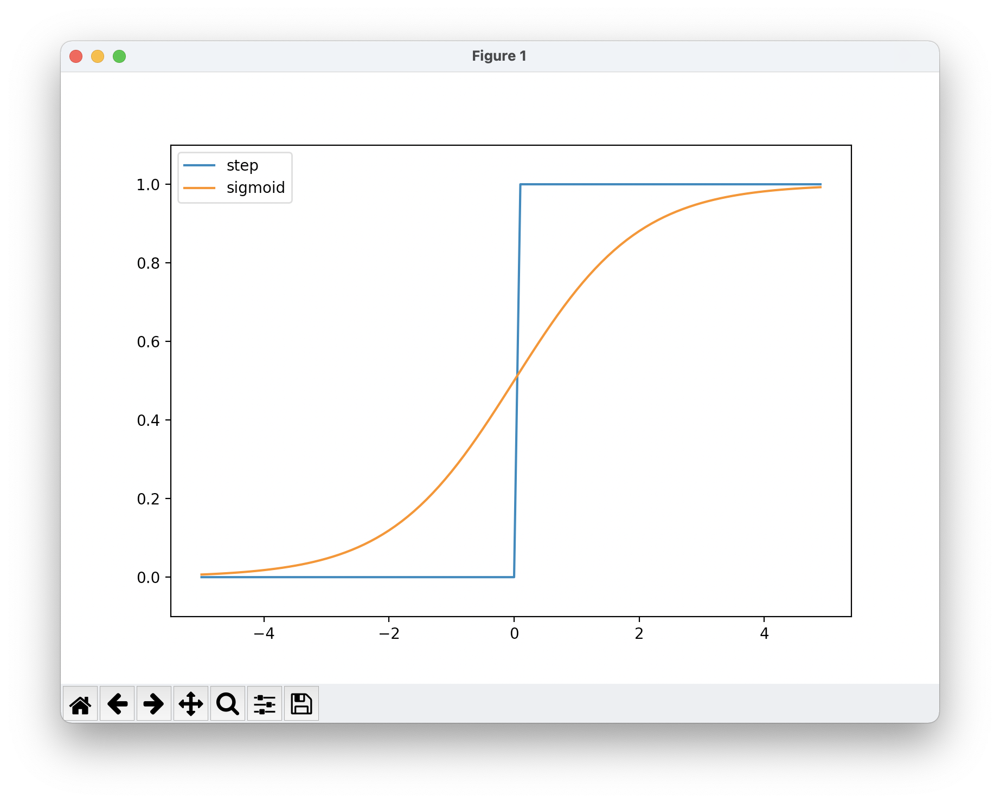

# ニューラルネットワーク
パーセプトロンは複雑な関数であっても層を重ねることで表現できるが、そのためのパラメータ設定(期待する入力と出力を満たすような値を決めること)は人の手で行わなければならない。

それを解決するのがニューラルネットワークで、
**ニューラルネットワークは適切な重みパラメータをデータから自動的に学習することができる**。

※**この章ではニューラルネットワークが行う「識別」処理についての話**

### ニューラルネットワークの図
左から、「入力層」「中間層」「出力層」と呼びます。(中間層は「隠れ層」と呼ぶことも) 
層の数え方が人によって違うようで、ここでは順に第0層、1層、2層と数える。

## 活性化関数
以下の図は、上で書いた、 $b(1)$ と $\chi_1$ と $\chi_2$ を入力として受け取り、 $y$ を
出力するパーセプトロンです。

数式に直すと、以下の式。 
新しく出てきた「b」はバイアスで、ニューロンの「発火」のしやすさをコントロールする。 
入力信号3つにそれぞれ重みが乗算され、次のニューロンに送信される。 
次のニューロンでは、送られてきた「信号の和」を計算し、0を超えたら1を、そうでなければ0を出力する。

$$
y =
\left\{
  \begin{array}{c}
    \text{ 0 ($b + \omega_1\chi_1 + \omega_2\chi_2 \leqq ０ $ )}\\\
    \text{1 ($b +\omega_1\chi_1 + \omega_2\chi_2 > ０ $ )}
  \end{array}
\right.　
$$

入力信号の総和( $a$ )を0か1かに変換する「 $h(x)$ 」という関数にして、上の式をシンプルにする。 

$$
a = b + w_1x_1 + w_2x_2
$$

$$
y = h (a)
$$

$$
h(x) =
\left\{
  \begin{array}{c}
    \text{ 0 ($x \leqq ０ $ )}\\\
    \text{1 ($x > ０ $ )}
  \end{array}
\right.
$$

このような入力信号の総和を出力信号に変換する関数を**活性化関数**という。活性化関数は入力信号の総和をどのように発火させるかを決める役割。

ここで使われている、**総和が0を超えたら1を、それ以外は0を出力する活性化関数のことを「ステップ関数」や「階段関数」と呼ぶ。** 
(※パーセプトロンでは活性化関数にステップ関数を利用していると言える。)

活性化関数をステップ関数から別の活性化関数に変更することでニューラルネットワークになる。 
**パーセプトロンとニューラルネットワークの違いは使用する活性化関数だけ。**

## シグモイド関数
ニューラルネットワークでよく使われる活性化関数の1つ。 
式。 

$$
h(x) = \dfrac{1}{1 + exp(-x)}
$$

## ReLU関数
**入力が0を超えたら、その入力をそのまま出力し、0以下ならば0を出力する活性化関数。** 
式。 

$$
h(x) =
\left\{
  \begin{array}{c}
    \text{ $x$ ($x > ０ $ )}\\\
    \text{0 ($x \leqq ０ $ )}
  \end{array}
\right.
$$

## ステップ関数とシグモイド関数
ステップ関数は0か1の出力に対して、シグモイド関数は実数を返す。 
両者とも、入力が小さいときに出力は0に近く、入力が大きくなるにつれ、出力が1に近づく。また、ステップ関数は折れ曲がった線、シグモイド関数は滑らかな曲線でどちらも**非線形**である。

### 非線形関数
ニューラルネットワークでは**非線形関数を使用する。線形関数は用いてはならない。** 
例えば、入力に対して定数倍となるような線形関数 $h(x) = cx$ を活性化関数としたとき、 $y(x) = h(h(h(x))) $ を行うような3層のネットワークで考えると、1度の掛け算でできてしまう( $y(x) = c^3x $ )ので、隠れ層のないネットワークでできてしまい、多層にする利点を活かせない。

### 実装

### グラフ
 

## 3層ニューラルネットワークの実装

入力層が2つ(第0層)、1つ目の隠れ層が3つ(第1層)、2つ目の隠れ層が2つ(第2層)、出力層2つ(第3層)で構成されたニューラルネットワーク。ここにバイアスのためのニューロン①と1層目の信号伝達に使用する重みを加える。

 

入力層から中間層1-1(a1)までの信号伝達を式で表す。 
Aが1層目の総和、xが入力層、Bがバイアス、Wが重み。

$$
A = \left( a_1, a_2, a_3 \right), X = \left( x_1, x_2 \right), B = \left( b_1, b_2, b_3 \right)
$$

 

$$
W = 
\left(
\begin{array}{ll}
w_{11} & w_{21} & w_{31} \\
w_{12} & w_{22} & w_{32}
\end{array}
\right)
$$

中間層1-1のニューロンをa1、2行3列の重みWとして、重み付きの和の式は以下となる。

$$
a_1 = X_1W_{11} + X_2W_{12} + B_1
$$

和であるa1を活性化関数 $h()$ に通したものをz1として、すべての中間層1(1-1,1-2,1-3)の和を計算し、z1, z2, z3と出力を得たら、その出力をまた中間層2(2-1, 2-2, 2-3)へと信号を伝達していき、出力層yまで同様に計算する。

以下実装
---

[ニューラルネットワークの実装](/src/3/3-3.py)

活性化関数にソフトマックス関数というものを使用している。 
ソフトマックス関数の出力は0から1.0の間の実数になり、総和は1になるという特徴がある。
この性質のおかげで、ソフトマックス関数の出力を **「確率」** として解釈できる。

## 出力層の設計
ニューラルネットワークは、**分類問題**と**回帰問題**の両方に使うことができるが、分類問題と回帰問題でそれぞれ出力層の活性化関数を変える必要がある。

一般的に以下のように用いる。

* 回帰問題 -> 恒等関数
* 分類問題 -> ソフトマックス関数

### 出力層のニューロンの数
ニューロンの数は得問題に応じて適宜決める。 
分類を行う問題では、分類したい数に設定するのが一般的

例) ある入力画像に対して、数字の0から9のどれかを予測する問題 -> 数は「10」に設定する。

## 手書き数字の認識
実践的な問題で、手書き数字画像の分類を行う。 
ここでは学習済みのパラメータを使用して、ニューラルネットワークの **「推論」** 部分のみを実装する。
※ 推論処理はニューラルネットワークの順方向伝播とも言う。

MNISTデータセットという、有名な手書き数字の画像セットを利用して推論を行う。 
データは0から9までの数字画像が入っており、28x28のグレー画像で各ピクセルは0〜255までの値を取る。

### 実装

[手書き数字の推論実装](/src/3/3-4.py)

### バッチ処理
先程の実装は画像を1枚ずつ、`predict()`で推論処理をしていたが、まとめて100枚分を一気に入力データとして渡すようなこともできる。推論の処理時間短縮になる。

[手書き数字推論(バッチ処理)実装](/src/3/3-5.py)

